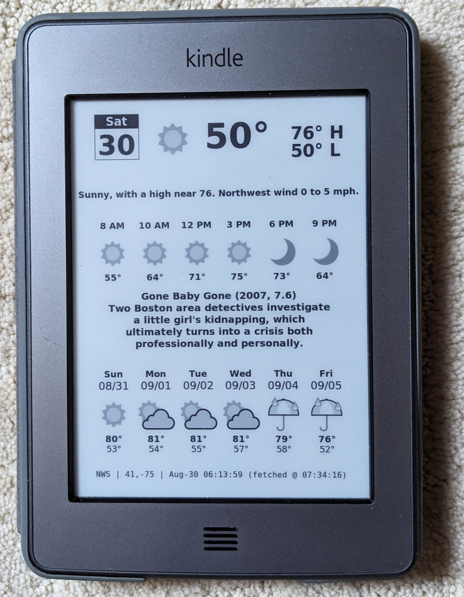

# Kindle Weather Station

Turn an old Kindle into an always-on e-ink weather station.
This guide walks you through jailbreaking, installing required tools, setting up SSH access, and running a script that displays weather images on the Kindle screen.

⚠️ Disclaimer 
This process modifies your Kindle firmware. Proceed at your own risk. 
Make sure your Kindle model and firmware version are compatible before starting. 
Always keep a backup of your Kindle’s content.

📋 Requirements
* A compatible Kindle device (e.g., Paperwhite, Touch, or other 5.x firmware models).
* USB cable to connect Kindle to your computer.
* Weather image source (e.g., generated PNG files via a web server).
* Basic Linux command-line knowledge.

The following is a list of high level steps for Kindle Touch. The jailbreak instructions may differ depending on the Kindle model. Please search internet (esp. the MobileRead Kindle Hacking Thread) for more details. 
https://www.mobileread.com/forums/showthread.php?t=225030

🔓 Step 1: Jailbreak the Kindle 
Download the jailbreak package: kindle-5.4-jailbreak.zip 
Unzip it on your computer. 
Copy all extracted files and folders to the root of your Kindle (not inside “documents”). 
On the Kindle: go to Settings → Menu → Update Your Kindle. This will install the jailbreak. 
Reboot the Kindle when finished.

🔧 Step 2: Apply Jailbreak Hotfix 
After the jailbreak, install the hotfix package to keep the jailbreak active during future updates. 
Copy the hotfix .bin file to the Kindle root. 
Run Update Your Kindle again.

🔑 Step 3: Install Developer Certificates 
Install developer certificates so that custom packages can run: 
Update_mkk-20250419-k5-ALL_keystore-install.bin 
Copy this .bin file to the Kindle root. 
Run Update Your Kindle.

📂 Step 4: Install KUAL (Launcher) 
KUAL (Kindle Unified Application Launcher) is the control panel for custom extensions. 
Copy KUAL-KDK-2.0.azw2 to your Kindle documents folder. 
After a reboot, you’ll see KUAL in the Kindle library as a book. Open it to launch.

📦 Step 5: Install MrInstaller 
MrInstaller allows you to install additional packages. 
Unzip MrInstaller. 
Copy the extensions and mrpackages folders to the Kindle root. 
Open KUAL → Helper → MR Installer to manage packages.

🌐 Step 6: Install USBNetwork (SSH Access) 
Copy Update_usbnet_0.22.N_install_touch_pw.bin into the mrpackages folder. 
Open KUAL → Helper → MR Installer → install USBNet. 
After installation: 
Go to KUAL → USBNet.
- Enable WiFi SSH at boot.
- Disable USB SSH (optional).

Connect to the Kindle via SSH (replace with Kindle’s IP):
- ssh root@192.168.x.x
- On first connection, create an authorized keys file:
-- mkdir -p /mnt/us/usbnet/etc
-- nano /mnt/us/usbnet/etc/authorized_keys
- Paste your public SSH key, save, and exit.
- Reboot the Kindle to apply changes.

🌦️ Step 7: Weather Display Script 
Now with SSH session, you can set up a background job that displays weather images. 
Make system partition writable:
- mntroot rw 
Copy /etc/upstart/startup.conf (included in this repo) 
Make system partition read-only again:
- mntroot ro 
Copy weather script to /mnt/us/local/bin, and make it executable (included in this repo)
- update the KINDLE_WEATHER_URL to your web server that can generate the weather station in image format (more in the Reference section below)
- chmod +x /mnt/us/local/bin/weather 
(This script will use /tmp tmpfs to keep the PNG file updates to avoid wearing out internal storage, it will also disable Kindle native UI so that status bar is not displayed.)

Reboot the Kindle—your weather image will now refresh every 20 minutes.

🔗 References 
For web server to render weather information, you can use this Docker image: [Weather station web server container image](https://hub.docker.com/r/gadget1999/rpi-nook-weather) 
Once the web server is running, you can use this URL to get the weather info in 600x800 PNG: https://yourserver/kindle_image 
With the container image, you can provide quotes to display (mine is showing IMDB good movies, but you can use, e.g., quotes of the day)

